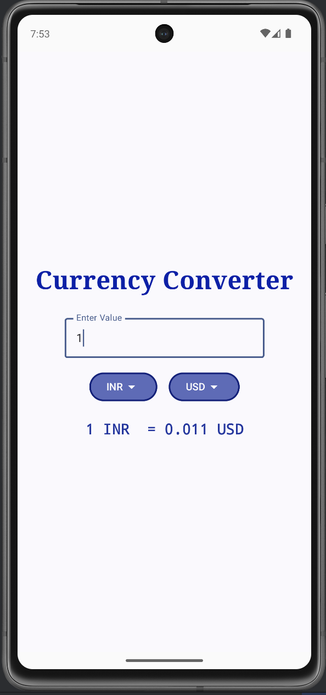
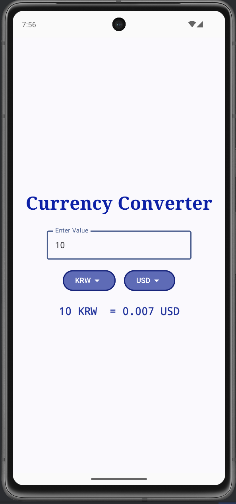
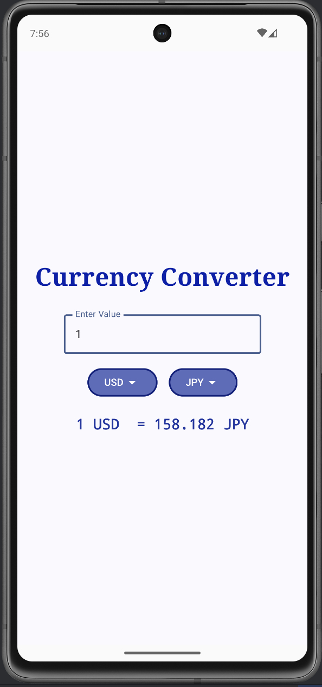
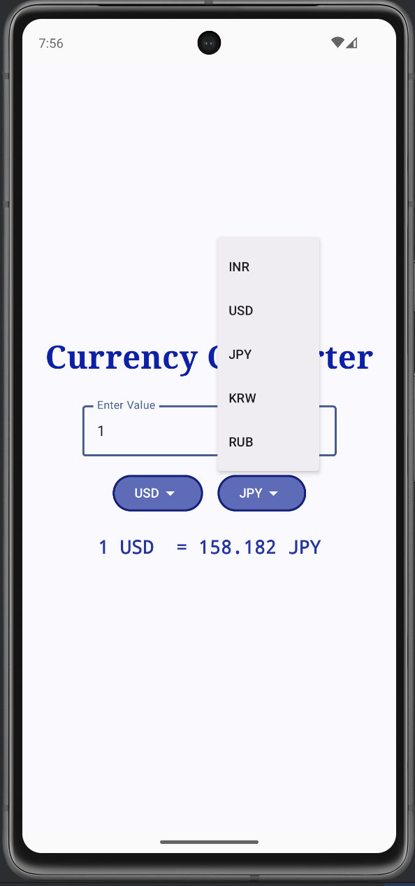
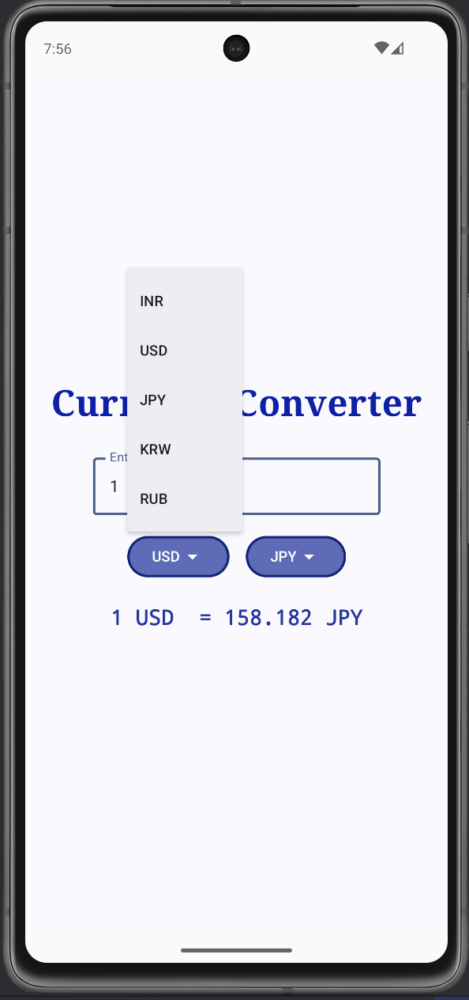
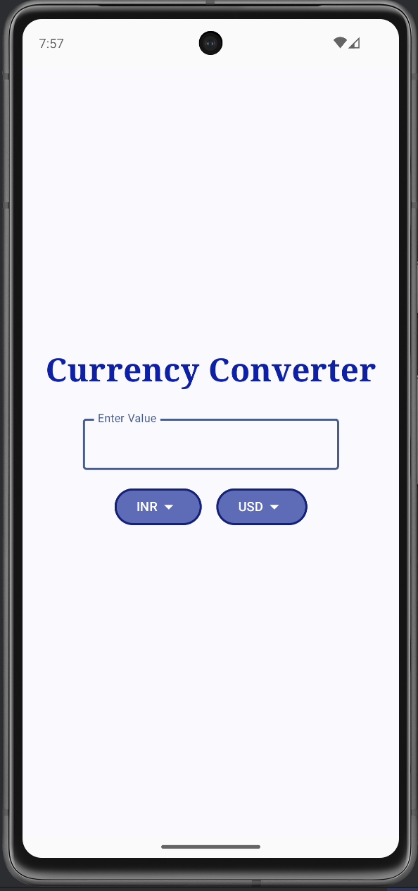

# 💱 Currency Converter App (Jetpack Compose)

A simple Android currency converter built using **Jetpack Compose** and **Material 3**.

The app allows users to enter an amount, select input and output currencies from dropdown menus, and instantly see the converted result.

This project focuses on:

- Jetpack Compose UI
- State management with `remember`
- Dropdown menus
- Real-time conversion logic
- Clean Material 3 layout

---

## ✨ Features

- Convert between:
  - INR
  - USD
  - JPY
  - KRW
  - RUB
- Instant calculation as you type
- Dropdown currency selection
- Input validation
- Clean centered layout
- Three decimal precision

---

## 🛠 Tech Stack

- Kotlin
- Jetpack Compose
- Material 3
- Android Studio

---

## 📱 How It Works

1. Enter an amount
2. Select input currency
3. Select output currency
4. Conversion happens automatically

## 📸 App Snapshots

  
  
  

  
  
  

  

